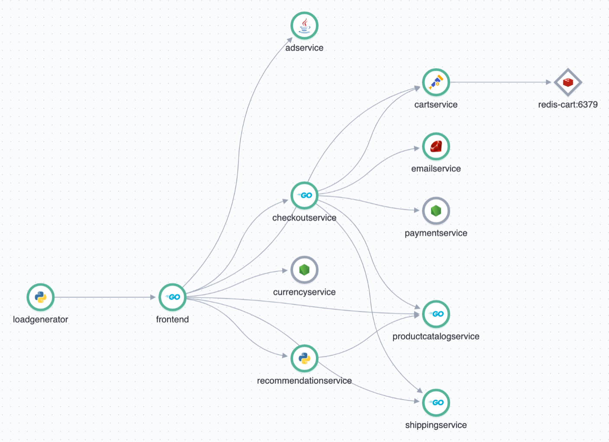
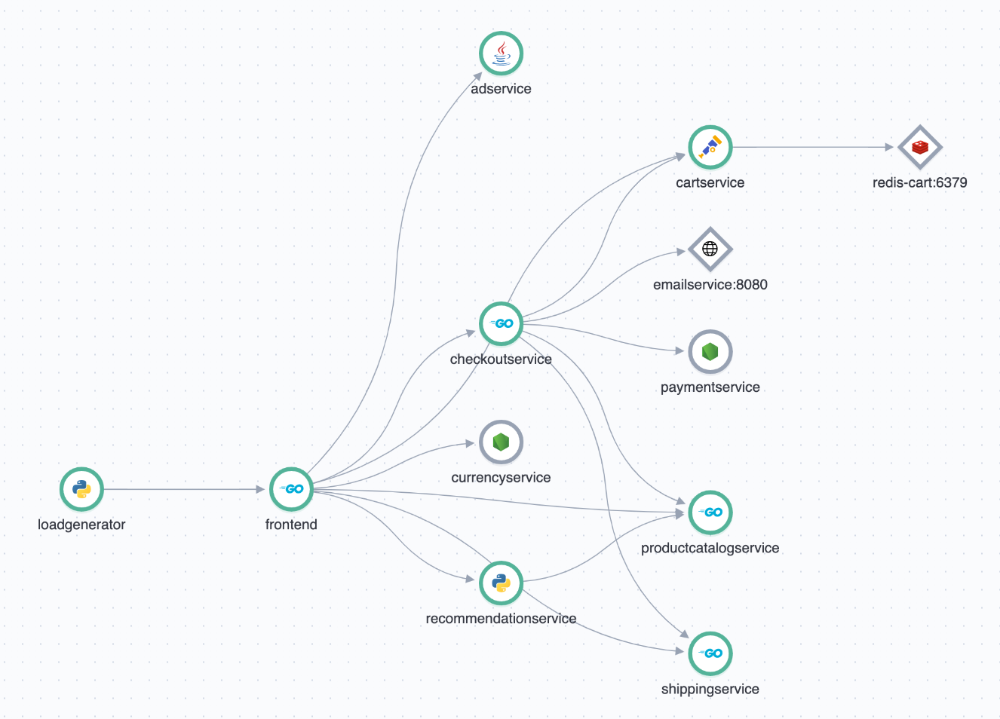

# Integration with Elasticsearch APM

This document describes the modifications made for sending OpenTelemetry traces, metrics and logs to Elasticsearch APM

## Pre-requisites

- Docker Desktop
- Elastic Agent 8.x with APM integration installed locally

Check connection to APM with `curl http://localhost:8200`. Expected result is similar to this:

```
{
  "build_date": "2022-05-25T06:13:22Z",
  "build_sha": "5bd955fad9c4e20c0fa404d3a7f34ae1973803fe",
  "publish_ready": true,
  "version": "8.2.2"
}
```

## Running with OpenTelemety Collector

The basic configuration just adds an OTLP Exporter pointing to APM to the OpenTelemetry Collector [config file](../src/otelcollector/otelcol-config.yml). After running `docker compose up -d` data will start flowing into APM. The APM Service Map will look like this:

[](./img/apm-service-map.png)

## Connecting OpenTelemetry Agents directly to APM

The alternative configuration connects Agents directly to APM (where possible). It also removes the Jaeger and Prometheus exporters from OpenTelemetry Collector [config file](../src/otelcollector/otelcol-config-apm.yml). Direct connections are enabled through setting environment variables for each service in [docker-compose-apm.yml](../docker-compose-apm.yml):

```
      - OTEL_EXPORTER_OTLP_ENDPOINT=http://host.docker.internal:8200
      - OTEL_TRACES_EXPORTER=otlp
      - OTEL_LOGS_EXPORTER=otlp
      - OTEL_METRICS_EXPORTER=otlp
```

Note that for the `frontend` service the version of the OpenTelemetry components for Go had to be updated from 1.7.0 to 1.8.0. With 1.7.0, the service wasn't exporting any traces, with no errors logged.

### Limitations

Applying the changes described above to `emailservice` will not work. With `OTEL_EXPORTER_OTLP_ENDPOINT=http://host.docker.internal:8200` the container logs error

```
ERROR -- : OpenTelemetry error: unexpected error decoding rpc.Status in OTLP::Exporter#log_status - Error occurred during parsing
ERROR -- : OpenTelemetry error: Unable to export 12 spans
```

With `OTEL_EXPORTER_OTLP_TRACES_ENDPOINT=http://host.docker.internal:8200` the error changes to 

```
ERROR -- : OpenTelemetry error: Unable to export 4 spans
```

which indicates that the TRACES endpoint must be specified explicitly.

It is very difficult to debug this because of [this](https://github.com/open-telemetry/opentelemetry-ruby/issues/1160) issue in `opentelemetry-ruby`.

The APM Service Map reflects the failed connection:

[](./img/apm-service-map-broken.png)
